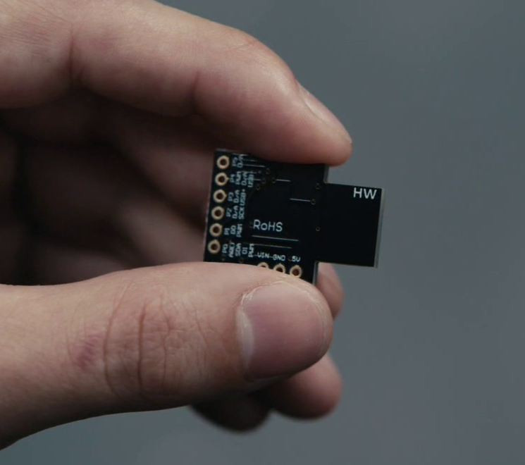

# DigiSparkMrRobot
Inspired by Mr Robot, a DigSpark Tiny85 Arduino (and a bit of python) project

This particular project assumes a Windows 10 PC is the target, with Python 3 
installed:
* Opens a Powershell script
* Downloads a Python tkinter script that looks like a hollywood hacking effect.
* Runs the script
* Deletes the script
* Rickrolls with EDGE
